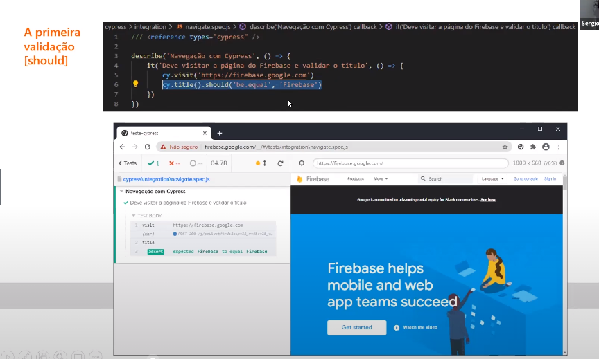

# Implementando testes automatizados usando Cypress em uma aplicação Angular

Cypress : Framework para testes e2e 

- só não é compativel com browser mobile 

-

- stubs : chamadas fake que só retorna chamadas de sucesso ou falso ,sem validação nenhuma  
- mocks : chamada de serviço que retorna payload 

## Tipos de testes 

- Interface de usuario 
Elementos exibidos na tela: bota link  texto , etc 

- APIs
Requisições http rest/soap e Websocket 

REST x SOAP
O REST opera por meio de uma interface consistente para acessar os recursos nomeados. É mais usado quando se publica uma API pública pela Internet. 

Já o SOAP, por outro lado, expõe componentes da lógica do aplicativo como serviços, e não como dados. Além disso, opera por meio de diferentes interfaces. 

Simplificando, o REST acessa os dados enquanto o SOAP executa operações por meio de um conjunto mais padronizado de mensagens. Ainda assim, na maioria dos casos, tanto REST como o SOAP podem ser usados para obter o mesmo resultado (e ambos são infinitamente escaláveis), com algumas diferenças na forma como são configurados.

# Instalação

- npm install cypress 
- estrutura de diretorios 

- run roda os testes 
- open roda a engine de testes 
- pode-se criar a aplicação e a aplicação de teste separadas (este é o recomendado e nao colocar o cypress dentro da aplicação , o que pode poluir a estrutura de projeto)
-  open roda a engine de testes  lista todos seus testes 
- recomenda-se a execução dos testes em electron e não em edge ou chrome
- clique no teste que quer executar 
# Recursos 
- como navegar ? [visit]~

- verificando se o titulo é igual ao que queremos 

- localizando um elemento na tela 
- nao recomenda-se usar a forma abaixo para o angular que gera muitos elementos dinâmicos 

- Executando uma ação click 
- force (consegue passar por componentes com visible false)

- podemos usar wait para aguardar até um componente ser exibido 
- fazendo mock de uma requiseção  HTTP 

- sempre que o site fizer a requisicção ele reposnde com usuario teste 
valida a chamda feita e verifica se conseguiur fazer o mock 
- fluxo completo 

- Melhorando a estrutura do teste 

- grava videos das execuções feitas 

